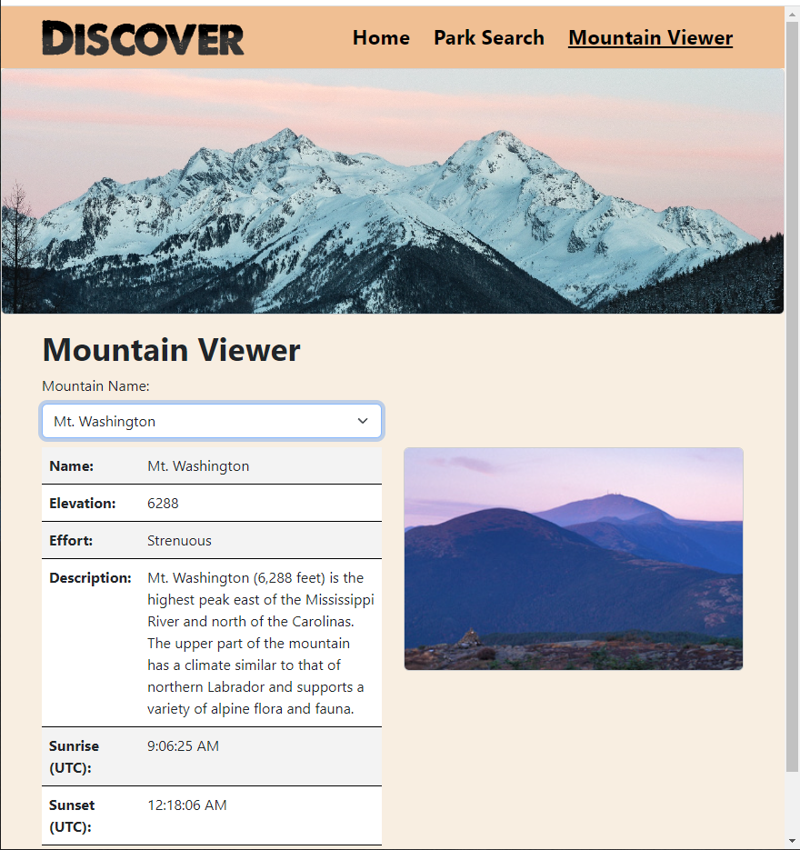

# EnjoyTheOutdoors

Capstone 2. Dynamically display information depending on a user's form selection.

## Home Page

Looping, muted, video used as a banner, with a section below displaying randomly fetched wildlife images.




### Home Page's Random Image Generator

Objects containing a different Loremflickr URLs are stored in an array.

```
let imageFiles = [
    {
    url: "https://loremflickr.com/320/240/sea,fish",
    description: "A slippery fish. ",
    },
    ...
]
```

A random number is genereated between 0 and the array.length. This is used to reference a URL to return a specific category of animals. ?random=x, where x is a number, is added to the end of the URL to ensure a unique picture is chosen even if the same animal category is chosen twice.

```
function populateCard(cardEl, imgArray) {
    const imgEL = cardEl.querySelector("img");
    const randInt = Math.floor(Math.random() \* imgArray.length);
    imgEL.src = imageFiles[randInt].url + "?random=" + counter;
    imgEL.alt = imageFiles[randInt].description;
    counter++;
    console.log(randInt);
}
```

## Parks Search Page

A still image used as a banner up top. Below are two dropdowns to filter search and a view all parks checkbox.

### Parks Page Search

When a selection is made in either dropdown: the selected value is determined, the table is reset, and the checkbox is unchecked. Matches based on the selected value are found and then stored in an array. A series of checks are then made to determine what to display.

The first check is if the current array is empty and then if it is supposed to be empty. If it is supposed to be empty the next step is to check if the other array is empty. There is no need to check if the other array is also at the default value, because that is handled by the form reset function. If the other array has something that is displayed on the table.

```
if (currentArray.length === 0) {
    if (currentSelection !== "choose") {
      parksTableEl.style.display = "none";
      searchMessageEl.textContent = "No Matches Found";
    } else if (otherArray.length === 0) {
      parksTableEl.style.display = "none";
      searchMessageEl.textContent = "No Matches Found";
    } else {
      otherArray.forEach((park) => generateTableRow(tableBody, park));
    }
  }
```

If none of the previous statements evaluate it is now known that the current array found matches. The next step is to check if the other array is empty and if it is supposed to be. Lastly if both the current array and other array contain results then they must be compared. If no similarities are found than an error is displayed, otherwise the result is displayed on the table.

```
   else if (otherArray.length === 0) {
    if (otherSelection !== "choose") {
      parksTableEl.style.display = "none";
      searchMessageEl.textContent = "No Matches Found";
    } else {
      currentArray.forEach((park) => generateTableRow(tableBody, park));
    }
  } else {
    commonMatches = currentArray.filter((parkLoc) =>
      otherArray.includes(parkLoc)
    );
    if (commonMatches.length === 0) {
      parksTableEl.style.display = "none";
      searchMessageEl.textContent = "No Matches Found";
    }
    commonMatches.forEach((park) => generateTableRow(tableBody, park));
  }
```

When the view all checkbox is clicked the form is reset and the arrays are cleared. The main data set is then displayed on a table.

## Mountains Page

This page contains a banner image and a single dropdown with mountain names.

### Mountains Page Viewer

Mountain names are loaded into the dropdown through JS. Once a selection is made the resulting matching objects are processed individualy. The appropriate object properties are displayed on a table and the corresponding image url is placed in a img src attribute.

To display sunrise/sunset data, coordinate data from the matched object property is fed to the JS Fetch API. I could not figure out how to return a useful value from the function, so I set the html values from inside the function.

```
async function displayMountainSunData(lat, lng, sunsetEl, sunriseEl) {
  let response = await fetch(
    `https://api.sunrise-sunset.org/json?lat=${lat}&lng=${lng}&date=today`
  );
  let data = await response.json();
  sunsetEl.textContent = data.results.sunset;
  sunriseEl.textContent = data.results.sunrise;
}
```
